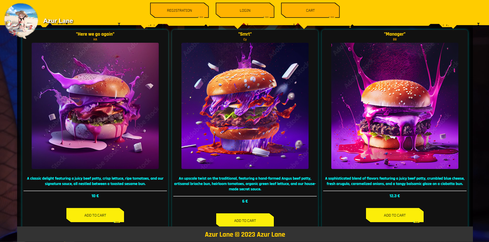
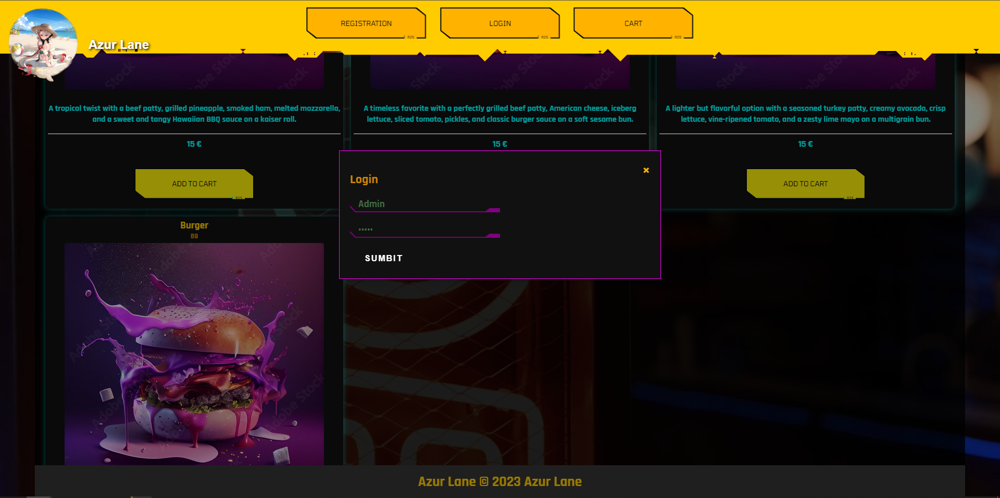
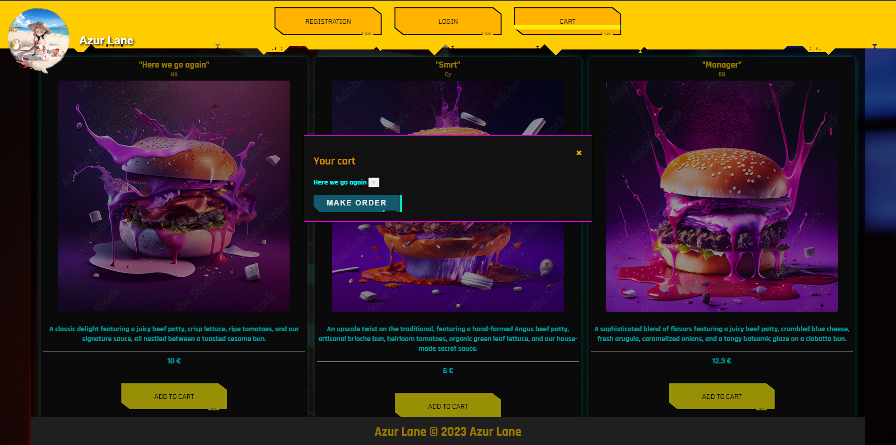
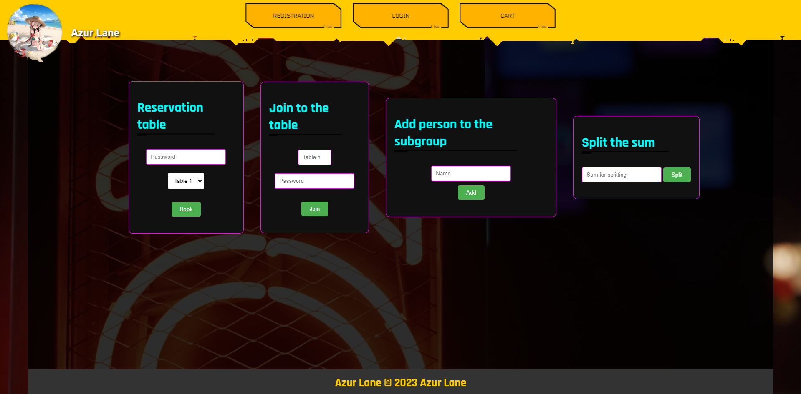

# 🚀✨ Azur Lane Site✨🚀

---

## 🎯 **Goals & Objectives**

### 🌟 **Picture Goals:**
- **Create a stunning cyberpunk UI** that looks like something out of 2077.
- Engage users with **interactive elements** like reservation systems, dynamic carts, and modals.
- Make the design **responsive** so it feels amazing on any device.

### 🛠️ **Specific Objectives:**
- **Reusable Design**: CSS components for glitch text, glowing buttons, and other effects.
- **Smooth Animations**: Jaw-dropping transitions and hover effects.
- **High Performance**: A fast and lightweight site that looks heavy-duty.


---

## ✨ **Features Overview**

This isn’t just a pretty site—there’s substance to the style! 🎉

### ⚡ **Core Features:**
1. **Cyberpunk UI Elements**
    - Buttons that light up when hovered 🖱️.
    - Text that glitches like it’s alive.
2. **Interactive Modals**
    - **Login Modal**: For entering user credentials.
    - **Cart Modal**: Dynamic cart for reservations/orders.
3. **Responsive Design**
    - Looks stunning on phones, tablets, and desktops. 📱💻
4. **Reservation System**
    - Let users book tables or reserve items with a stylish, easy-to-use form.

### 🌟 **Bonus Features:**
- Neon hover effects.
- Editable cart quantities.
- Animated navigation menu with smooth scrolling.

---

## 📂 **Detailed File Structure**

| 📁 **File/Folder**      | 📝 **Description**                                                                 |  
|-------------------------|-----------------------------------------------------------------------------------|  
| `index.html`            | Core structure of the site—includes modals, menus, forms.                        |  
| `style.css`             | Main stylesheet: defines layouts, colors, and responsiveness.                    |  
| `button_c2077.css`      | Special CSS just for cool cyberpunk-inspired buttons.                            |  
| `cyberpunk.css`         | Advanced animations, glitch effects, and glowing text styles.                    |  
| `script.js`             | All the JavaScript magic—handles interactivity, modals, and dynamic behaviors.   |  
| `/pics`                 | All assets, including background images and product pictures.                    |  
| `/screens`              | Screenshots showcasing the design and functionality of the project.              |  

---

## ⚙️ **Technical Implementation**

### 🛠️ **Frontend & Backend Stack:**
- **HTML5**


- **CSS3**: Advanced animations, responsive grids.


- **Vanilla JavaScript**: Interactions like opening modals and updating carts.

---

## 📸 **Screenshots**

### **1️⃣ Home Page**
✨ Vibrant neon layout with glowing buttons and glitchy headings.



---

### **2️⃣ Login Modal**
🔐 Smooth, futuristic modal for user login or signup.



---

### **3️⃣ Cart Modal**
🛒 A glowing, dynamic cart with editable quantities.



---

### **4️⃣ Forms fr our solution**
🌟 Futuristic text effects that scream *cyberpunk*.



---

## 💡 **Challenges & Solutions**

### 🔴 **Challenge: Modals Overlapping**
- **Problem**: Modals were stacking incorrectly, making it hard to use.
- **Solution**: Introduced a **z-index hierarchy** and ensured that only one modal is visible at a time.

### 🟡 **Challenge: Performance Issues on Mobile**
- **Problem**: Too many animations caused lag on lower-end devices.
- **Solution**: **Optimized animations** using GPU-accelerated properties like `transform` instead of `top`/`left`.

### 🟢 **Challenge: Responsive Text Glitches**
- **Problem**: Glitch effects broke on smaller screens.
- **Solution**: Adjusted font sizes and glitch intensity with **media queries**.

---

## 🛠️ **Getting Started**

### 🛠️ **Installation:**
1. Clone the repo:
   ```bash
   git clone https://github.com/yourusername/azur-lane-cyberpunk.git
   ```  
2. Open `index.html` in your browser.


3. Explore and enjoy the **neon vibes**! 🎉

---

